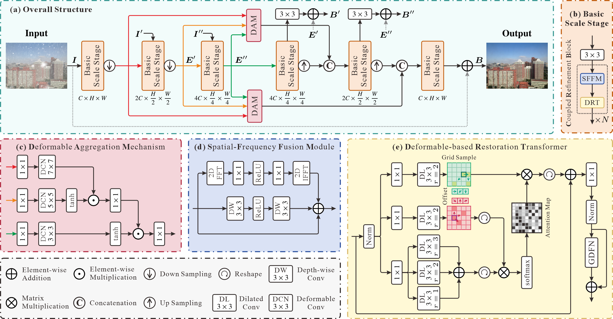

# DeRestormer: Image Restoration with Deformable-related Guidance
## Abstract

Image restoration tasks face significant challenges due to the complexity and variability of degradation patterns. Although convolutional neural networks (CNNs) effectively model local textures and structures, their fixed geometric operations limit the ability to adaptively capture diverse degradations. Transformer-based methods, despite excelling at modeling long-range dependencies crucial for global context understanding, usually encounter high computational costs and inadequate attention to local degradation details, hindering effective image reconstruction. In this work, we propose DeRestormer, a Transformer-based multi-scale image restoration framework that employs deformable attention within Transformer blocks to effectively address various low-quality image restoration problems. The deformable attention mechanism uses a small set of sampling positions to pre-filter and highlight key elements, allowing the model to focus on important regions of the feature map while efficiently handling irregular and complex degradation patterns. Additionally, we incorporate deformable convolutions at the bottleneck stage to dynamically adjust sampling locations across different scales for the purpose of effective multi-scale feature capture, flexible aggregation of spatially varying information, and improved fusion of fine-grained details with global context. Extensive experiments demonstrate that DeRestormer achieves state-of-the-art performance in various image restoration tasks. The project and pretrained models of our work are available at [https://github.com/Kingsley-Cyl/DeRestormer](https://github.com/Kingsley-Cyl/DeRestormer).

# Overview



## Usage

**Installation**

This code was tested with the following environment configurations. It may work with other versions.

- CUDA 11.8
- Python 3.8
- PyTorch 2.1.0+cu118

You can manage your virtual environment with conda by conducting the following commands: 

```shell
conda create -n DeRestormer python=3.8
conda activate DeRestormer
cd <this repository>
pip install -r requirements.txt
```

**Pretrained Weights**

You can find and download all the pretrained Weights at  [Baidu Netdisk](https://pan.baidu.com/s/16BLNtCYDTRcOQpZpTosrAQ?pwd=t6w4) (Password: t6w4).

**Training**

The training code will be updated soon.

**Testing**

The testing code will be updated soon.

## Results

1. *for DID-Data and DDN-Data datasets*: PSNR and SSIM results are computed by using this [Matlab Code]().
2. *for other datasets*: PSNR and SSIM results are computed by using this [Matlab Code]().

**Image deraining**

| **Dataset** | **PSNR** | **SSIM** | Visual Results                                               |
| :---------- | :------- | :------- | ------------------------------------------------------------ |
| Rain200L    | 41.61    | 0.9901   | [Baidu Netdisk](https://pan.baidu.com/s/1Cycy3MVwNqVN8On8hx-ayQ?pwd=vuw8) (vuw8) |
| Rain200H    | 32.10    | 0.9343   | [Baidu Netdisk](https://pan.baidu.com/s/1W4Oa9c6C4hpinHOZnTvzTA?pwd=px59) (px59) |
| DID-Data    | 35.52    | 0.9661   | [Baidu Netdisk](https://pan.baidu.com/s/1DiW8jK2H5i0_04sdygutCg?pwd=4v53) (4v53) |
| DDN-Data    | 34.43    | 0.9594   | [Baidu Netdisk](https://pan.baidu.com/s/1dHI-MVaBBri5ck8yw3ZChg?pwd=67gj) (67gj) |
| SPA-Data    | 49.21    | 0.9927   | [Baidu Netdisk](https://pan.baidu.com/s/1jNIDiHG6YXYVgXtFWfe3WQ?pwd=tvuu) (tuvv) |

**Image desnowing**

| **Dataset** | **PSNR** | **SSIM** | Visual Results                                               |
| :---------- | :------- | :------- | ------------------------------------------------------------ |
| CSD         | 40.84    | 0.99     | [Baidu Netdisk](https://pan.baidu.com/s/1SCUp9JuC-oHn2AHIYTUM0Q?pwd=6dej) (6dej) |
| SRRS        | 35.77    | 0.99     | [Baidu Netdisk](https://pan.baidu.com/s/1S-n0e47Ssu8kVXvpheg__w?pwd=uf3f) (uf3f) |
| Snow100K    | 35.36    | 0.96     | [Baidu Netdisk](https://pan.baidu.com/s/1ab091Coqzzgcf93Vx7q2DA?pwd=4x6c) (4x6c) |

**Image dehazing**

| **Dataset**  | **PSNR** | **SSIM** | Visual Results                                               |
| :----------- | :------- | :------- | ------------------------------------------------------------ |
| SOTS-Indoor  | 41.75    | 0.996    | [Baidu Netdisk](https://pan.baidu.com/s/1mXp7fGPVcnQxvIFXB1UQ_Q?pwd=5vg3) (5vg3) |
| SOTS-Outdoor | 37.77    | 0.995    | [Baidu Netdisk](https://pan.baidu.com/s/1vCbHzd8cPsaUnOHvtxdILQ?pwd=25pp) (25pp) |
| Haze4K       | 34.04    | 0.99     | [Baidu Netdisk](https://pan.baidu.com/s/1CHAenWrduCbeLUw8wsyxTA?pwd=i4g9) (i4g9) |

**Image motion deblurring**

| **Dataset** | **PSNR** | **SSIM** | Visual Results                                               |
| :---------- | :------- | :------- | ------------------------------------------------------------ |
| GoPro       | 33.51    | 0.972    | [Baidu Netdisk](https://pan.baidu.com/s/1cUG0-5jdf-NHkKFXfcE-3A?pwd=6fj3) (6fj3) |
| HIDE        | 31.60    | 0.962    | [Baidu Netdisk]() ()                                         |

## Acknowledgement

This code is based on [MSDT](https://github.com/cschenhm/MSDT), [NeRD-Rain](https://github.com/cschenxiang/NeRD-Rain), and [DeformDeweatherNet](https://github.com/IntelligentDrivingCoding/DeformDeweatherNet). Thanks for their awesome work.